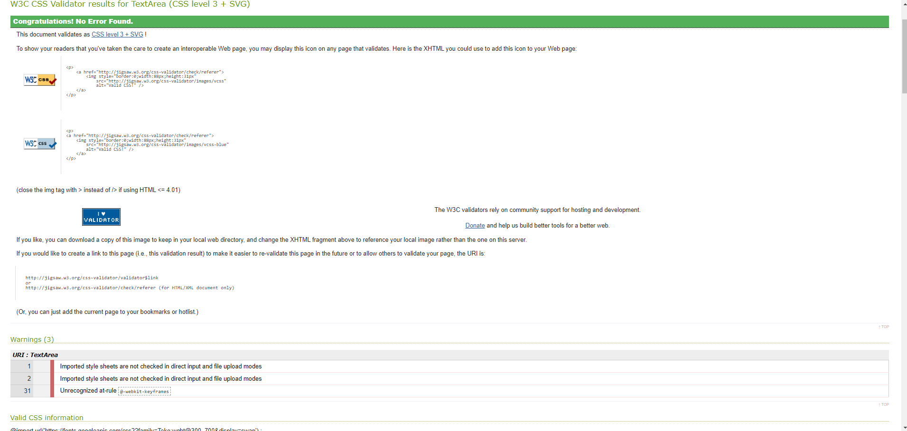
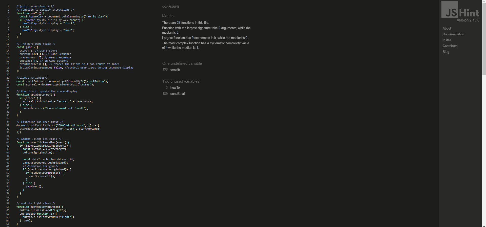

<h1 allign="center" id="title"> Sequence Squares </h1>

[Live Project can be viewed here.](https://kenya-rae.github.io/sequence-square-game/)

Sequence Squares is a online memory game that will puut your memory to the test. Give yourself a challenge in remembering the sequence. How long can you remember sequences for?

## Table of Contents

### User Experience (UX)

- [Project Goals](#project-goals)
- [User Goals](#user-experience-ux)
- [Developer Goals](#developers-goals)
- [User Stories](#user-stories)
- [Design Choices](#design-choices)
- [Wireframes](#wireframes)

### Features

- [Loaded page](#loaded-page)
- [Feedback Form](#feedback-form)
- [How to Play ](#how-to-deploy-to-github-pages)
- [Game in Progress](#game-in-progress)
- [Correct Sequence Alert](#correct-sequence-alert)
- [Game Over Alert](#game-over-alert)
- [Future Features](#future-feautres)

### Testing

- [Bugs](#bugs)

### Deployment

- [How to Deploy Site](#deployments)

### Credits

- [Credits](#credits)
- [Code](#code)
- [Acknowledgments](#acknowledgments)

## User Experience (UX)

### Project Goals

This project goal is to use JavaScript to build a simple game. A game that is memory based and similar to the well know Simon Says game. This project has a target audience is anyone ages 6+, and those whom like to play games in their spare time.

#### Recruiters Goals

The main audience for this site is anyone aged 6+.

#### User Goals:

- To sucessfully complete the game.
- Enjoy the game.
- Challenege memory.

#### Developers goals:

- Create a simple and interactive game.
- Demonstrate the use of Javescript.
- Make an enjoyable game for users.

#### User Stories

As a user I want:

- To play a interactive game, that is also fun and enjoyable.
- To understand the instructions given.
- Increase the difficulty.
- Consistent functionalities.

As the site owner I want:

- A fun game that I and others enjoy.
- A structured and simple code
- Demonstrate what I have learnt with JavaScript.
- Clear and intruvitity within my game/site.
- A game that functions and is consistent.

## Design Choices

### Languages Used

- HTML
- CSS
- JavaScript

### Fonts

- The font Teko was used for the main title and the sub title of "How to Play?"
- Poppins was used for the instructions on how to play and the footer elements.

### Icons

- For my footer elements, I used a basic icons to identify my social links. These are easy to recognise also.
- The website icon, I created it on Favicon. I created four squares, with two squares solid to represent the game.

### Colours

- I used a black background and some bold bright colours to make it more appealing to the game, I think it gives a arcade game feel.
- The colours of this project were all randomised via [Coolors](https://coolors.co/a8d5e2-f9a620-ffd449-548c2f-104911) and then selected by myself.

### Images

- Favicon Icon images can be found [Favicon](assets/images/favicon/)

### Video Files

- Link to video, used to show features [Sequence Square Game Video](assets/video/sequence-squares-game.mp4).

### Wireframes

The design choices were decided over the development of this project. The Wireframes for the orginal design can be found [here](assets/images/wireframes/original/)
The overall site has changed over development. This was due to the complexity it may have when building. As this is my first time working with JavaScript. I wanted to make something very simple and basic, due to where my skill set currently is. The wireframe for the final look can be found [here](assets/images/wireframes/finals/)

- Wireframes was created using [Balsamiq](https://balsamiq.com/).

## Features

- Functional footer which provides link to GitHub and my portfolio.
- Instructions collapse area, is functional and able to see how to play the game.
- Favicon used to give individuality to the site.
- Responsive for all screen sizes.
- Easy navigation and simiple to interact with.
- Identifiable buttons.
- Feedback form that allows emails to be sent in order to recieve feedback from users.

### Loaded page:

When you first load on the page you are meet with a "Start" and "Instructions" button.

User Interface

### Feedback Form:

A simple feedback form at the bottom of the page. Allowing users to provide feedback in what they would prefer, what they liked and disliked etc.

Feedback Form

When you have successfully sent your email over, an alert will display to show that this has been sent.

Feedback Sent

### How to Play:

The instruction button when clicked, displays that instructions on how to play the game.

How to Play

### Game in Progress:

When you press start, the sequence will display. Each square will flash a light one at a time. You will have to repeat the sequence once the computer has finished displaying their sequence.

https://github.com/user-attachments/assets/ef96fd9d-1452-48a8-928d-68f2ae11a51f

### Correct Sequence Alert:

If you match the sequence correctly an alert will display before the next round.

Correct sequence Alert

### Game over Alert:

The game over alert will display when you incorrectly select the wrong button.
  

Game Over Alert

## Future Feautres

- I plan to have a ending level to cap the game once a certain level has been reached. In result, I would like to incorperate a winning celeberation on the screen for the successful users. Or change the alerts to text elements on the page.
- Furthermore I would also like to add sound to the game, whether that is with the game buttons or putting an radio/api that alsos the user to play the game as well as listen to their favourite songs.
- As well as this I would like to make the game visibly inactive if the game has not been started or provide a start menu that will take you to the game.
- I would like to dive in to different colour schemes to improve user experience and accessibility for screen readers.
- Within the furture, I would like to implent another mode as suggest in my testing section. This game could be a great challenge mode and have a standard game with less buttons but same game to make it less complex from the start. Also to add a count down on the start button for a new game and for each succussful round.

## Accessibility

- Ensured that the flashlight up styling had to be transparent to ensure the everyone can see the sequence being flashed.
- Used colours that would interfer or clash with eachother, easy on the eye.

## Testing

### Manual Testing

| What to test        | Expected Results                                         | Passed   |
| ------------------- | -------------------------------------------------------- | -------- |
| Start Button        | Start the game                                           | &#x2714; |
| Instructions Button | Display how to play the game                             | &#x2714; |
| Game Buttons        | Show the game sequence and allow user input to repeat it | &#x2714; |
| Feedback Form       | Allow user input and send feedback email                 | &#x2714; |
| Footer links        | Send user to correct pages                               | &#x2714; |

### For this project I have had friends and family ranging from 7-56 years old, test amongst of various devices. Such as;

- Iphone 12 Pro - Safari, Portrait mode.
- Iphone 11 Pro - Safari, Portrait and Landscape mode.
- Iphone 13 - Safari, Portrait and Landscape mode.
- MacBook - Chrome.
- Iphone XR - Safari, Portrait Mode.
- Iphone 15 - Safari, Portrait Mode.
- Ipad 9th Gen - Safari, Landscape Mode.
- Ipad
- Ipad 7th Gen - Safari, Portrait
- HP Pavillion Gaming Laptop 17 - Chrome
- Samsung S12 - Samsung Internet, Portrait mode.
- Iphone 13 - Safari, Portrait and Landscape Mode.

After collating the data from my testers, the general concensious over Sequence Squares is that it is a good functional game. All buttons and functionalities worked correctly as they should. No mention of the flow of the page, however, some suggestions were similar to my future features. Suggestions such as a countdown timer for the start of each round, starting rounds with a fewer buttons and have a success rate that will then increase the difficultiy once the user has developed some confidence and be switched on in the game. As for the sucessful or game over alerts, it was suggested to have glowing text within the page itself that will signify if there is a next level, game over or game complete.

Another tester had stated that this should be an app as this is something they would play as they travelled. Although, I had a feedback form below by habit my tested messaged me back instead. However, one test did infact use the feedback form and I had recieved the follow screenshot below, in which the tester expressed the same suggestions. They had also mentioned that yellow and orange square looked somewhat similar which had them a bit confused when it came to repeating the sequence. As well having this current code as a challenge mode and have easier mode with less buttons in the standard games.

Feedback Email

To follow the GDPR guidelines I have cropped out the email and name of tester.

### Lighthouse - Developer Chrome Tools

Using the Google Chrome Developer tools, I had used Lighthouse within an icognito browser (due to extentison interference) to look at the overall quality of my site.

Lighthouse Overview

 

Although the overall quality over my site was a score of 91, the accessibility of my site could improve significantly.

Lighthouse Acessibility

 

I have recognised that some elements (Square buttons) were missing Aria attributes within them. I rectofied this by adding aria-label to my div buttons to improve this. As well as this, background and foreground colors do not have suffiecent contrast ratio.

I had few diagnostics within the lighthouse section that could be improved.

Lighthouse Diagnostics

 

Overall I understand how to resolve a few of them. However currently, "Serve static assets with an efficent cache policy", "Avoid serving legacy JavaScript to modern browers" and "Eliminate render-blocking resources" are things im not to sure how to resolve. I have read in to these diagnostics and have tried to improve on things that was within my capacity. Such as the contrasting with the slogan "Square Up" it was previously a yellow glow, though changing to a red/pink has removed this issue.

Once I made all the changes, I retested my site in Lighthouse. I had better results:
 

Lighthouse Overview - After changes

### Validators

W3c was used to validate HTML, CSS and JavaScript code.

HTML Validator:

HTML Validator Overview Part 1

HTML Validator Overview Part 2

HTML Validator Overview Part 3

HTML Validator Overview Part 4

 
Overall, I needed to neaten up my html by removing some attrtubutes (for attrbute within the submit button element and type within the script elements in the head). I also changed the paragraph element within the list element of how to play, as this was not allowed to - these were changed to a list item. I have noticed the info text, I had removed the "/" from the closing tags, due to the autosave extension I have the slash is automtically returned to the end of the self-closing element. This doesn't interfere with the web itself. However moving forward I will remove this extension to reduce the feedback within this validator. Once I had made the changes to the errors/warnings, I had a successful pass with no warnings and errors. (Though the info for the ending tags with the "/" still appeared as expected.)

 

HTML Validator - Pass

 
CSS Validator:
 

CSS Validator - Pass

There were nothing to report back or fix within my css as far as the validator is concencerned.

JavaScript Validator:
 
 
When using the JavaScript validator, I had somefeedback in regards to undefined and unsed variables.

JavaScript Validator

 
It states that emailjs is undefined, im unsure if I need to define this as a variable. As this syntax was copied from emailJS and modified with my service and template ID.

As for **_howTo() and sendEmail()_**, they have come back as unsed. This could be due to function not being currently used in the site. However, the functionality of the site is not effected by this.

## Bugs

### Current Bugs

- Currently no outstanding bugs. The console displays the follow message:
 

Console Message

I had ensure paths for favicon were linked correctly and refreshed the page and this was resolved.

 

Console Message - After Change

This current message, are things im unable to resolve due to the submission date. However, no effect on the website or user experience.

 

### Fixed Bugs

- When hovering over the squares within the grid, squares would move. I found that this could be caused due to the child elements not being "fixed" within the parent div. I used box-sizing: border-box to resolve my issue for now.
- Cannot set properties of null (setting 'innerText') - showScore (script.js:31:46), newGame (script.js:19:3), HTMLButtonElement.onclick ((index):18:55). It seemed I had a typo when getting my element within the showTurns function.
- Undefined data result when checking current game in dev tools. Checked data attributes within my html div square classes and changed them to data-id, this allowed me to pull the correct data within the script.js file.
- Sequence started immediately on page load, due to sequence function being called at the very start. I had removed this function from the pure game start.
- Sequence didn't increase, it used all 9 buttons within one sequence, calling them one after another. However, It wouldn't increment. This was because I hadnt called the sequnence and combined it with "++".
- New game would be called everytime, even when user was successful in copying sequence. I had mixed up a lot of the game logic. I had to restructer and go through the copy and remove some called functions.
- EmailJS function work when email has been sent. When testing in the development or deployed area, it seems that there is a limit of how many emails are sent out.
- (Not much of a bug)The original 9 buttons had been reduced to 6. As I wasnt sure how to increase difficulty once a user was successful due to how I incremeneted the sequence. I had removed 3 buttons and tried this game with 6 buttons and it naturally increases the difficulty.
- (Not much of a bug)Whilst trying to disable my squares, I had realised that I'm unable to disable and enable this due to these being div elements. I had tried to disabling the playarea until the the game is start but this ruins the structure of the page. Due to the deadline of this project, im unable to change and the code to accomidate this. However, now obtain the information to not make this error again.

## Deployments

This project was deployed to GitHub Pages using the steps below;

### How to Deploy to GitHub Pages.

1. Open the browser, search GitHub and log in. If you do not have an account, sign up [here](https://github.com/login).
2. Locate and select the [Sequence Squares](https://github.com/Kenya-Rae/sequence-square-game).
3. Once the repository is open, select settings.
4. Select 'Pages', which is found on the left-hand side under the Code and Automation category.
5. Underneath build and deployment, there are two sub-heading 'Source' and 'Branch'. Select the 'None' dropdown below the branch sub-heading.
6. Change the 'None' option to 'Main', then press "Save".
7. Wait a few moments whilst the pages refresh. (This could take up to 5 minutes.)
8. You may need to refresh the page, to see the saved changes. You should have seen that the site and the link to the live site. An orange icon will display which will indicate that the save changes are still loading.
9. You can also check your deployment by selecting 'Code'. On the right-hand side, you should see 'Deployments'. Select 'Deployments' to view the status of your deployments.

### How to run this project locally.

To clone this project to Gitpod use the following steps;

1. Open the browser, search GitHub and log in. If you do not have an account, sign up [here](https://github.com/login).
2. Open a new tab, search Gitpod and log in. If you don't have an account, you can sign in with GitHub.
3. Open a new workspace.
4. Go back to the GitHub tab and locate [Sequence Squares](https://github.com/Kenya-Rae/sequence-square-game).
5. Click the green "<> Code" button.
6. Under the HTTPS tab, copy the URL for the repository.
7. Go back to your Gitpod Workspace and open the terminal.
8. Change the location of your current working directory to where you want the cloned directory.
9. Type "git clone", then paste the URL that you had copied earlier from GitHub.
10. Press Enter to create your local clone.

### How to Fork this prjoect.

To fork this project from Gitpod, please follow the steps below;

1. Open the browser, search GitHub and log in. If you do not have an account, sign up [here](https://github.com/login).
2. Locate the GitHub tab and locate the project you want to fork. [Sequence Squares.](https://github.com/Kenya-Rae/sequence-square-game)
3. At the top right-hand side of the page, you will see a "Fork" button. Click on the button and wait a few moments. You should see the new forked respository under your own GitHub account.
4. By defualt the folk is named as their upstream repositories, you can rename the repostories by typing a name in the "Repository name" field.
5. You can also add a description to your fork and/or copy the default branch only.
6. To also access the files in the repository. Head over to your forked respository. Click the green "<> Code" button.
7. Under the HTTPS tab, copy the URL for the repository.
8. Go to the workspace you have created earlier.
9. To change the current directory to the location where you want the cloned directory.
10. Type "git clone" and paste the URL you copied from the Github. Press "Enter" and your local clone will be created.

## Credits

### Frameworks, Libraries and Programs Used

- [Balsamiq](https://balsamiq.com/) - For creating wireframes.
- [GitHub](https://github.com/) - To store my repository and deploy site.
- [Gitpod](https://www.gitpod.io/) - Used to write code for this project.
- [coolors](https://coolors.co/a8d5e2-f9a620-ffd449-548c2f-104911) - Used to find colours for the website.
- [Font Awesome](https://fontawesome.com/) - For Icons in the footer
- [EmailJS](https://www.emailjs.com/) - Used to create email service for my feedback form.
- [Am I responsive](https://ui.dev/amiresponsive) - To show my website in different browsers for responsive design.
- [Favicon](https://favicon.io/) - To make and generate my website icon.
- [HTML Validation](https://validator.w3.org/) - To validate my HTML Code.
- [CSS Validation](https://jigsaw.w3.org/css-validator/) - To validate my CSS code.

### Code

- [CSS Buttons](https://www.w3schools.com/css/css3_buttons.asp) - For shawdowing properties.
- [Toggle Hiding and Showing](https://www.w3schools.com/howto/howto_js_toggle_hide_show.asp) - How to get my toggle to work on the instructions.
- [Bootstrap Media Queries](https://getbootstrap.com/docs/4.1/layout/overview/) - Used their basic media query for my project and put my own css styling.
- [Glowing Text](https://www.w3schools.com/howto/howto_css_glowing_text.asp) - Used to create glowing effect on "Square Up!" slogan.

### Acknowledgments

- [Martina Terlevic](https://github.com/SephTheOverwitch) - Supported me through the project, listened and allowed me talk about my concerns and thoughts about JavaScript. Giving advice not just for my projects but in life to.
- [Zahria](https://github.com/zioan) - For allowing me to go through my concerns with JavaScript. Aiding my thinking when writing and debugging code. Showed me how to use the prettier extention on GitPod, due to my horrible indentations.
- [Mitko Bachvarov](https://code-institute-room.slack.com/team/U03R20N303G) - Supported my last mentor session before submitting this project. Gave great suggestions on current project and provided knownelge for moving forward with logical code.
- [Bro Code JS Course](https://www.youtube.com/watch?v=lfmg-EJ8gm4&t=32962s) - As I wasnt understanding the concepts well, I discovered this video that explain clear enough for me to understand JS concepts.
- [W3schools](https://www.w3schools.com) - Used as a refresher.
- Friend and family who helped test and supported me through the emotions of this project. As this proved to be a challenge.

[Back to top](#title)
