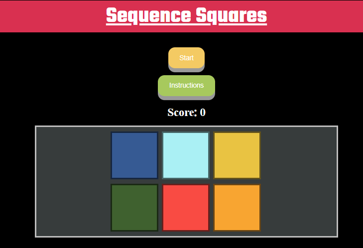

<h1 allign="center" id="title"> Sequence Squares </h1>

[Live Project can be viewed here.](https://kenya-rae.github.io/sequence-square-game/)

Sequence Squares is a online memory game that will puut your memory to the test. Give yourself a challenge in remembering the sequence. How long can you remember sequences for?

## Table of Contents

### User Experience (UX)

- [Project Goals](#project-goals)
- [User Goals](#user-experience-ux)
- [Developer Goals](#developers-goals)
- [User Stories](#user-stories)
- [Design Choices](#design-choices)
- [Wireframes](#wireframes)

### Features
- [Loaded page](#loaded-page)
- [Feedback Form](#feedback-form)
- [How to Play ](#how-to-deploy-to-github-pages)
- [Game in Progress](#game-in-progress)
- [Correct Sequence Alert](#correct-sequence-alert)
- [Game Over Alert](#game-over-alert)
- [Future Features](#future-feautres)
### Testing
- [Bugs](#bugs)
### Deployment
- [How to Deploy Site](#deployments)
### Credits

- [Credits](#credits)
- [Code](#code)
- [Acknowledgments](#acknowledgments)

## User Experience (UX)

### Project Goals
This project goal is to use JavaScript to build a simple game. A game that is memory based and similar to the well know Simon Says game. This project has a target audience is anyone ages 6+, and those whom like to play games in their spare time.

#### Recruiters Goals

The main audience for this site is anyone aged 6+.

#### User Goals:
- To sucessfully complete the game.
- Enjoy the game.
- Challenege memory.

#### Developers goals:
- Create a simple and interactive game.
- Demonstrate the use of Javescript.
- Make an enjoyable game for users.

#### User Stories

As a user I want:
- To play a interactive game, that is also fun and enjoyable.
- To understand the instructions given.
- Increase the difficulty.
- Consistent functionalities.

As the site owner I want:
- A fun game that I and others enjoy.
- A structured and simple code
- Demonstrate what I have learnt with JavaScript.
- Clear and intruvitity within my game/site.
- A game that functions and is consistent.

## Design Choices
The design choices were decided over the development of this project. The [Wireframes](#wireframes) were a starting point. As development went on, the structure and game changed as well.

### Languages Used 

- HTML
- CSS
- JavaScript

### Fonts
- The font Teko was used for the main title and the sub title of "How to Play?"
- Poppins was used for the instructions on how to play and the footer elements.

### Icons 
- For my footer elements, I used a basic icons to identify my social links. These are easy to recognise also.
- The website icon, I created it on Favicon. I created four squares, with two squares solid to represent the game.  

### Colours
- I used a black background and some bold bright colours to make it more appealing to the game, I think it gives a arcade game feel.
- The colours of this project were all randomised via [Coolors](https://coolors.co/a8d5e2-f9a620-ffd449-548c2f-104911) and then selected by myself. 

### Images
- Favicon Icon images can be found [Favicon](assets/images/favicon/)

### Video Files
 - Link to video, used to show features [Sequence Square Game Video](assets/video/sequence-squares-game.mp4).

### Wireframes
- Wireframes was created using [Balsamiq](https://balsamiq.com/). The overall site has changed over development. This was due to the complexity it may have when building. As this is my first time working with JavaScript. I wanted to make something very simple and basic, due to where my skill set currently is.
- Wireframes can be found [here](assets/images/wireframes/).

## Features
- Functional footer which provides link to GitHub and my portfolio.
- Instructions collapse area, is functional and able to see how to play the game.
- Favicon used to give individuality to the site.
- Responsive for all screen sizes.
- Easy navigation and simiple to interact with.
- Identifiable buttons.
- Feedback form that allows emails to be sent in order to recieve feedback from users.

### Loaded page: 
When you first load on the page you are meet with a "Start" and "Instructions" button.

### Feedback Form:
A simple feedback form at the bottom of the page. Allowing users to provide feedback in what they would prefer, what they liked and disliked etc.
 

When you have successfully sent your email over, an alert will display to show that this has been sent.
 

### How to Play:
The instruction button when clicked, displays that instructions on how to play the game.

### Game in Progress:
When you press start, the sequence will display. Each square will flash a light one at a time. You will have to repeat the sequence once the computer has finished displaying their sequence.

https://github.com/user-attachments/assets/ef96fd9d-1452-48a8-928d-68f2ae11a51f

### Correct Sequence Alert:
If you match the sequence correctly an alert will display before the next round.
 

### Game over Alert:
The game over alert will display when you incorrectly select the wrong button.
 

## Future Feautres
- I plan to have a ending level to cap the game once a certain level has been reached. In result, I would like to incorperate a winning celeberation on the screen for the successful users.
- Furthermore I would also like to add sound to the game, whether that is with the game buttons or putting an radio/api that alsos the user to play the game as well as listen to their favourite songs.

## Accessibility
- Ensured that the flashlight up styling had to be transparent to ensure the everyone can see the sequence being flashed.
- Used colours that would interfer or clash with eachother, easy on the eye. 

## Testing

### For this project I have had friends and family ranging from 7-56 years old, test amongst of various devices. Such as;
-
-
-
-
-

## Bugs
- When hovering over the squares within the grid, squares would move. I found that this could be caused due to the child elements not being "fixed" within the parent div. I used box-sizing: border-box to resolve my issue for now.
- Cannot set properties of null (setting 'innerText') - showScore (script.js:31:46), newGame (script.js:19:3), HTMLButtonElement.onclick ((index):18:55). It seemed I had a typo when getting my element within the showTurns function.
- Undefined data result when checking current game in dev tools. Checked data attributes within my html div square classes and changed them to data-id, this allowed me to pull the correct data within the script.js file.
- Sequence started immediately on page load, due to sequence function being called at the very start. I had removed this function from the pure game start.
- Sequence didn't increase, it used all 9 buttons within one sequence, calling them one after another. However, It wouldn't increment. This was because I hadnt called the sequnence and combined it with "++".
- New game would be called everytime, even when user was successful in copying sequence. I had mixed up a lot of the game logic. I had to restructer and go through the copy and remove some called functions.
- EmailJS function work when email has been sent. Though the test email is not sending over. Could this be due to the undeployment of the site?
- (Not much of a bug)The original 9 buttons had been reduced to 6. As I wasnt sure how to increase difficulty once a user was successful due to how I incremeneted the sequence. I had removed 3 buttons and tried this game with 6 buttons and it naturally increases the difficulty.

## Deployments
This project was deployed to GitHub Pages using the steps below;
### How to Deploy to GitHub Pages.
1. Open the browser, search GitHub and log in. If you do not have an account, sign up [here](https://github.com/login).
2. Locate and select the [Sequence Squares](https://github.com/Kenya-Rae/sequence-square-game).
3. Once the repository is open, select settings.
4. Select 'Pages', which is found on the left-hand side under the Code and Automation category.
5. Underneath build and deployment, there are two sub-heading 'Source' and 'Branch'. Select the 'None' dropdown below the branch sub-heading.
6. Change the 'None' option to 'Main', then press save
7. Wait a few moments whilst the pages refresh. (This could take up to 5 minutes.)
8. You may need to refresh the page, to see the saved changes. You should have seen that the site and the link to the live site. An orange icon will display which will indicate that the save changes are still loading.
9. You can also check your deployment by selecting 'Code'. On the right-hand side, you should see 'Deployments'. Select 'Deployments' to view the status of your deployments.

### How to run this project locally.
To clone this project to Gitpod use the following steps;

1. Open the browser, search GitHub and log in. If you do not have an account, sign up [here](https://github.com/login).
2. Open a new tab, search Gitpod and log in. If you don't have an account, you can sign in with GitHub.
3. Open a new workspace.
4. Go back to the GitHub tab and locate [Sequence Squares](https://github.com/Kenya-Rae/sequence-square-game).
5. Click the green "<> Code" button.
6. Under the HTTPS tab, copy the URL for the repository.
7. Go back to your Gitpod Workspace and open the terminal.
8. Change the location of your current working directory to where you want the cloned directory.
9. Type "git clone", then paste the URL that you had copied earlier from GitHub.
10. Press Enter to create your local clone.

## Credits

### Frameworks, Libraries and Programs Used
- [Balsamiq](https://balsamiq.com/). For creating wireframes.
- [GitHub](https://github.com/). To store my repository and deploy site.
- [Gitpod](https://www.gitpod.io/). Used to write code for this project.
- [coolors](https://coolors.co/a8d5e2-f9a620-ffd449-548c2f-104911). Used to find colours for the website.
- [Font Awesome](https://fontawesome.com/). For Icons in the footer 
- [EmailJS](https://www.emailjs.com/). Used to create email service for my feedback form.
- [Am I responsive](https://ui.dev/amiresponsive). To show my website in different browsers for responsive design.
- [Favicon](https://favicon.io/). To make and generate my website icon.
- [HTML Validation]()
- [CSS Validation]()

### Code
- [CSS Buttons](https://www.w3schools.com/css/css3_buttons.asp)- For shawdowing properties.
- [Toggle Hiding and Showing](https://www.w3schools.com/howto/howto_js_toggle_hide_show.asp) - How to get my toggle to work on the instructions.
- [Bootstrap Media Queries](https://getbootstrap.com/docs/4.1/layout/overview/) - Used their basic media query for my project and put my own css styling.

### Acknowledgments
- [Martina Terlevic](https://github.com/SephTheOverwitch) - Supported me through the project, listened and allowed me talk about my concerns and thoughts about JavaScript. Giving advice not just for my projects but in life to.
- [Zahria](https://github.com/zioan)- For allowing me to go through my concerns with JavaScript. Aiding my thinking when writing and debugging code. Showed me how to use the prettier extention on GitPod, due to my horrible indentations.
- [Bro Code JS Course](https://www.youtube.com/watch?v=lfmg-EJ8gm4&t=32962s) As I wasnt understanding the concepts well, I discovered this video that explain clear enough for me to understand JS concepts.
- [W3schools](https://www.w3schools.com) - Used as a refresher.
- Friend and family who helped test and supported me through the emotions of this project. As this proved to be a challenge.

[Back to top](#title)
